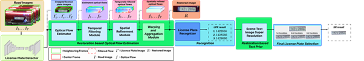
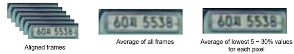
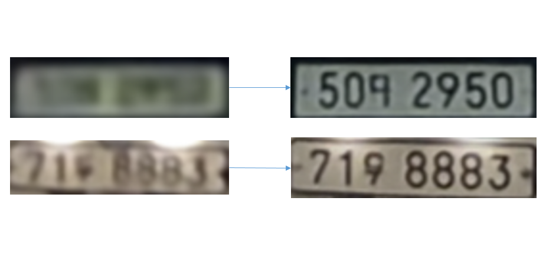

# 🚗 Dash Cam License Plate Restoration

블랙박스 영상에서 흐릿한 자동차 번호판을 고화질로 복원하는 딥러닝 기반 화질 개선 시스템입니다.



## 주요 기능
- DeepLabV3 기반 번호판 세그멘테이션
- FlowFormer++ 기반 Optical Flow 추정 및 Refinement
- 시공간적 일관성 보정을 통한 프레임 정렬
- CLAHE를 통한 대비 향상
- Scene Text 기반 복원 모델(TCDM)을 활용한 후처리

## 기술 스택
- Python 3.8+
- PyTorch, OpenCV
- DeepLabV3, FlowFormer++
- TCDM (Text Conditional Diffusion Model)
- CUDA 11.3 이상

## 핵심 알고리즘
### 1. License Plate Region Extraction
- DeepLabV3로 번호판 영역 추출 → 고정 비율(4:1)로 업샘플링
- Homography를 이용해 시점 보정
- 최종적으로 1장의 Pseudo-GT + 31장의 LR 번호판 프레임으로 구성

### 2. Optical Flow Estimation & Refinement
- FlowFormer++를 통해 각 프레임의 움직임 추정
- Temporal/Spatial Smoothness 기반 오류 보정 수행
- 기준 프레임으로 모든 프레임 정렬 (De-warping)

### 3. Aggregation & Post-processing
- 정렬된 프레임들을 집계하여 하나의 이미지로 생성
- CLAHE로 대비 개선
- TCDM으로 Scene Text Prior를 활용한 복원 향상

## 개발자 역할
- **DeepLabV3 기반 번호판 세그멘테이션**
  - 번호판 영역 검출 모델 구현 및 최적화
  - Precision 89%, Recall 87.5% 달성
  - Homography 기반 시점 보정 알고리즘 개발

- **TCDM 기반 후처리**
  - Scene Text Prior를 활용한 번호판 복원 모델 구현
  - Hallucination 현상 제거 및 복원 정확도 향상
  - ESRGAN, SwinIR 등 기존 모델 대비 우수한 성능 달성

## 성능 평가
### Detection 성능 (DeeplabV3)
| Metric     | Value |
|------------|-------|
| Precision  | 0.890 |
| Recall     | 0.875 |

### Optical Flow Refinement 효과
- 평균 RMSE 3.71% 개선
- Worst 30% frame 기준 RMSE 13.37% 개선

### 정성적 비교
- ESRGAN, SwinIR, TATT 등 최신 모델들과 비교
- Hallucination 현상 없이 번호판 복원 정확도 우수

## 결과 예시
### Optical Flow 정렬


### 최종 복원 (TCDM 적용)


## 프로젝트 구조
```
.
├── Data/                # 입력/출력 데이터
├── DT_core/            # 번호판 Detection (DeepLabV3)
├── FF_core/            # Optical Flow 보정 (FlowFormer++)
├── FlowFormerPlusPlus/ # FlowFormer++ 원본 코드
├── TCDM/               # 후처리용 텍스트 기반 복원 모델
├── scripts/            # 실행 스크립트 모음
└── main.py             # 메인 실행 스크립트
```

## 설치 및 실행
### 1. Conda 환경 설정
```bash
conda env create -f environment.yaml
conda activate SR
```

### 2. 모델 다운로드
- [model_v2.pth](https://drive.google.com/file/d/15pkZ2haNdr6uDVBE2iy8mcXLALLD70qf/view?usp=drive_link) → `DT_core/`에 저장

### 3. 실행 흐름
```bash
# 메인 실행
python main.py
```
- UI에서 영상 파일 드래그 & 드롭
- 번호판 시점(초 단위) 입력 → 차량/번호판 영역 선택 → 자동 복원 수행

## 산학협력 성과
- **NC& 기업과 산학과제 완료**
  - 실제 블랙박스 데이터 기반 모델 검증
  - 기업 요구사항에 맞춘 시스템 최적화
  - 성공적인 산학협력 프로젝트 완료

## 참고 문헌
- [DeepLabV3 (Chen et al., 2017)](https://arxiv.org/abs/1706.05587)
- [FlowFormer++ (Shi et al., 2023)](https://arxiv.org/abs/2303.01237)
- [TCDM (Scene Text Restoration)](https://arxiv.org/abs/2203.09388)

[📄 캡스톤 디자인 판넬 PDF 보기](src/capstone_panel.pdf)